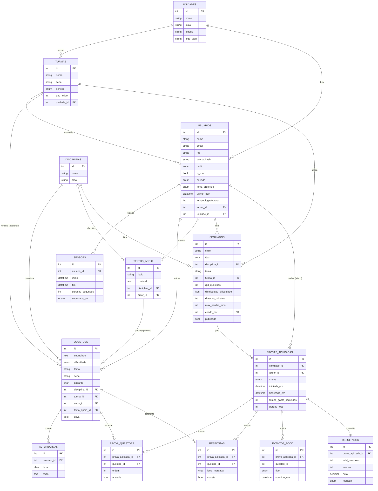

# Diagrama de Entidade‑Relacionamento (DER)

Modelo relacional do banco `simulados_etec_abh`. Renderiza no GitHub e em qualquer visualizador Mermaid.

## Regras de integridade destacadas
- `TEXTOS_APOIO` representa um trecho/texto-base opcional (comum em Humanas), compartilhável por várias `QUESTOES` via `texto_apoio_id` (FK nullable).
- `PROVAS_APLICADAS` tem chave única `(simulado_id, aluno_id)` → **uma prova por aluno/simulado** (1 tentativa).
- `PROVA_QUESTOES` tem chave única `(prova_aplicada_id, questao_id)` → **sem repetição** de questões na mesma prova.
- `RESPOSTAS` tem chave única `(prova_aplicada_id, questao_id)` → uma resposta por questão.
- `SIMULADOS.qtd_questoes` possui `CHECK (<= 20)` → **limite de 20 questões**.
- `RESULTADOS` é **1:1** com a prova aplicada.
