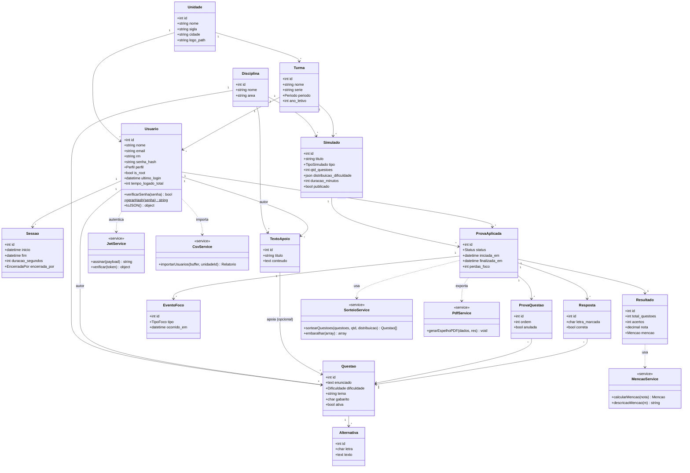

# Diagrama de Classes (UML)

Visão de classes da camada de aplicação (Models + Services principais).

## Enumerações
- **Perfil**: `aluno` · `professor` · `coordenador` (+ flag `is_root`)
- **Periodo**: `Manhã` · `Tarde` · `Noite` · `Integral`
- **Dificuldade**: `Fácil` · `Médio` · `Difícil`
- **TipoSimulado**: `aleatorio_aluno` · `geral`
- **Status** (prova): `gerada` · `em_andamento` · `concluida` · `expirada`
- **TipoFoco**: `blur` · `visibilitychange` · `copy` · `paste`
- **Mencao**: `I` · `R` · `B` · `MB`
